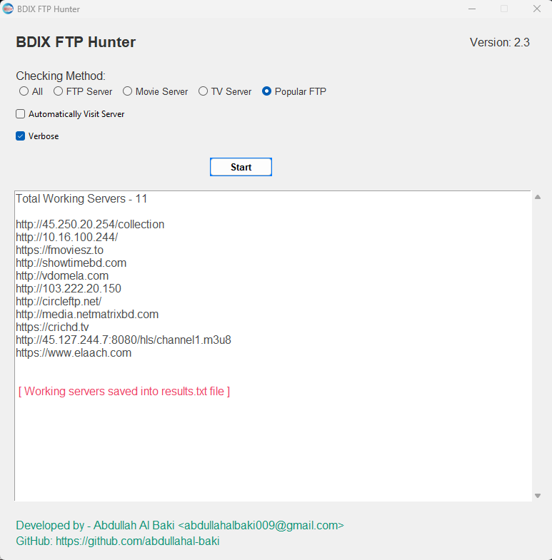
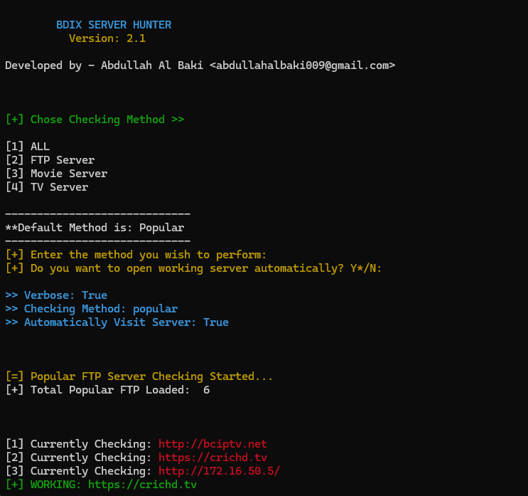

# BDIX FTP Hunter

BDIX FTP Hunter is the best tool for finding working FTP servers on your broadband connection. The best feature of this tool is that it can automatically open working servers on your browser.

Official Channel: https://t.me/bdixftphunter  
Chat Group: https://t.me/bdixftpchat

  

### Check Release 
or 
Download Link: [https://github.com/abdullahal-baki/bdix-ftp-hunter/releases/download/v-2.4/BDIX-FTP-Hunter-v2.4.exe](https://github.com/abdullahal-baki/bdix-ftp-hunter/releases/download/v-2.5/BDIX-FTP-Hunter-v2.5.exe)

## New GUI Version

## Old version

